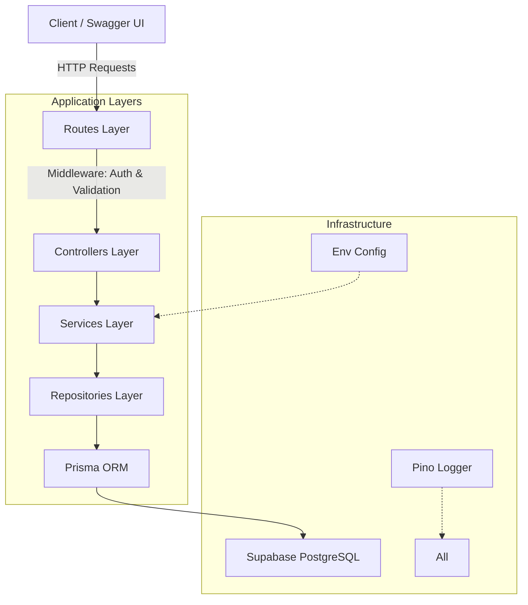

# Finance Dashboard Backend

A Node.js backend for a financial management dashboard built with Express, TypeScript, and Prisma. This project provides a secure, production-ready API with Role-Based Access Control (RBAC), JWT authentication, and automated database migrations specifically configured for Supabase PostgreSQL.

---

##  Live Deployment
- **API Base URL**: [https://finance-dashboard-backend-g732.onrender.com/](https://finance-dashboard-backend-g732.onrender.com/)
- **Interactive API Docs**: [https://finance-dashboard-backend-g732.onrender.com/api-docs](https://finance-dashboard-backend-g732.onrender.com/api-docs)

---

##  Architecture Diagram
The system follows a strict Layered/Clean Architecture pattern:



---

##  Project Structure
- **Routes**: API endpoint definitions and middleware orchestration.
- **Controllers**: HTTP request/response handling.
- **Services**: Business logic and application rules.
- **Repositories**: Data access layer using Prisma ORM.
- **Middleware**: Authentication, Authorization (RBAC), and Validation.

---

##  User Credentials (Demo)
Use these credentials to test the different permission levels in the Swagger UI:

| Role | Email | Password | Permissions |
| :--- | :--- | :--- | :--- |
| **ADMIN** | `admin@finance.dev` | `Admin@1234` | Full access (CRUD Records, User Management) |
| **ANALYST** | `analyst@finance.dev` | `Analyst@1234` | View records and dashboard data |
| **VIEWER** | `viewer@finance.dev` | `Viewer@1234` | Access to dashboard summary only |

---

##  Setup Instructions

### Pre-requisites
- Node.js (v18 or higher)
- Supabase account with a PostgreSQL project

### Database Setup
1. Copy the Connection URI from your Supabase project settings.
2. In your `.env` file, set `DATABASE_URL` (using Transactional mode on port 6543) and `DIRECT_URL` (using port 5432).

### Installation & Deployment
```bash
npm install
npm run prisma:generate
npm run prisma:deploy
npm run build
npm run start
```

---

##  Security & Production Features
- **RBAC Security**: Granular permissions enforced at the route level.
- **JWT Authentication**: Secure login and session management.
- **Validation**: Strict input schema validation using Zod.
- **Security Middleware**: Integration with Helmet, CORS, and Express Rate Limit.
- **Logging**: Structured industry-standard logging with Pino.

---

##  API Documentation
The API includes integrated OpenAPI/Swagger documentation.
- **Link**: `/api-docs` on the running server.
- **Spec**: `/api-docs.json` for external tools.
